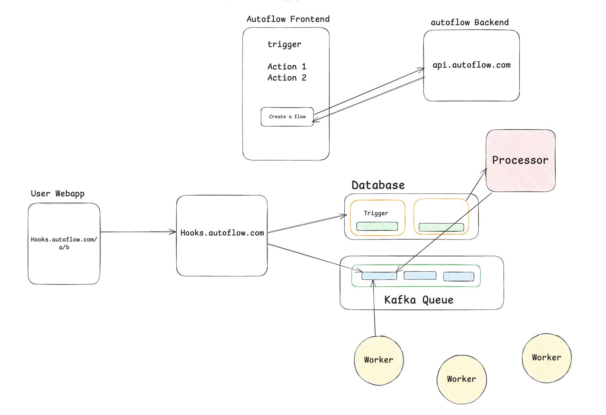

# Zapy

[](https://github.com/heymustafa02/Zapy/releases)
[](https://github.com/heymustafa02/Zapy/issues)
[](https://github.com/heymustafa02/Zapy/network)
[](https://github.com/heymustafa02/Zapy/stargazers)
[](./LICENSE)
[](http://makeapullrequest.com)

---

## ⭐ Overview

Zapy is a scalable, event-driven automation platform inspired by Zapier.  
It enables workflows that connect:

- 🔗 **Webhooks**
- 📧 **Email triggers**
- ⚡ **Blockchain actions (Solana & Ethereum)**
- 🧩 **Custom processors**
- 🔄 **Internal microservices**

This system supports **5 independent services**, all communicating via Kafka.  
Built with modern tooling, Zapy ensures **high scalability, modularity, and real-time event streaming**.

---
## 🎥 Demo


---

## 🚀 Features

### 🟢 Webhooks  
Trigger workflows programmatically from any external service or application.

### 📩 Email Notifications  
Send automated emails from workflows or processors.

### 🔶 Solana Integration  
Execute Solana-based tasks such as wallet notifications & token actions.

### 🟦 Ethereum Integration (NEW)  
**Added by you using Wagmi + Viem**

Zapy now supports ETH transfers:
- Send ETH directly from the dashboard  
- Wallet connection using Wagmi  
- Secure & verified transactions  
- Automatic workflow triggers on confirmed transfers  

### 📡 Kafka-Based Streaming  
All actions communicate asynchronously for maximum scalability.

### 🧰 Full-Stack System  
- Frontend: Next.js  
- Backend: Node.js + Express  
- Worker + Processor microservices  
- PostgreSQL databases using Prisma ORM  

---

## 🧱 Tech Stack

| Category | Technology |
|---------|------------|
| **Frontend** | Next.js, Wagmi, Viem, Tailwind |
| **Backend** | Node.js, Express |
| **Database** | PostgreSQL + Prisma ORM |
| **Messaging** | Kafka |
| **Blockchain** | Solana Web3, Ethereum (Wagmi + Viem) |
| **Containers** | Docker |
| **Language** | TypeScript |

---

## 🏗 System Architecture




---


# 📦 Getting Started

### 1️⃣ Clone the Repository

```bash
git clone https://github.com/heymustafa02/zapy.git
cd zapy
```
### 2️⃣ Install Dependencies (All Services)
```
cd frontend && npm i
cd ../primary_backend && npm i
cd ../hooks && npm i
cd ../worker && npm i
cd ../processor && npm i
```
### 3️⃣ Environment Variables Setup
Each service contains a .env.example.
Create a .env file in each folder:

```
cp frontend/.env.example frontend/.env
cp primary_backend/.env.example primary_backend/.env
cp hooks/.env.example hooks/.env
cp worker/.env.example worker/.env
cp processor/.env.example processor/.env
```
Required Environment Variables

```
frontend  	GOOGLE_CLIENT_ID, GOOGLE_CLIENT_SECRET, NEXTAUTH_SECRET, NEXTAUTH_URL
primary_backend  	DATABASE_URL
hooks  	DATABASE_URL
worker  	DATABASE_URL
processor  	DATABASE_URL
```
Add Ethereum fields:

```
ETH_RPC_URL=
WALLET_PRIVATE_KEY=
Add Solana fields:

SOLANA_RPC_URL=
SOLANA_PRIVATE_KEY=
```
### 4️⃣ Start Kafka
Using Docker:

```
docker run -p 9092:9092 -d apache/kafka:3.9.0
Create Kafka topic:

docker exec -it <container_id> /bin/bash
bin/kafka-topics.sh --create --topic zap-events --bootstrap-server localhost:9092
```
### 5️⃣ Run Database Migrations
```
cd primary_backend && npx prisma migrate dev
cd ../processor && npx prisma migrate dev
cd ../hooks && npx prisma migrate dev
cd ../worker && npx prisma migrate dev
````
### 6️⃣ Run All Services
Frontend
```
cd frontend
npm run dev
```
Primary Backend
```
cd primary_backend
tsc -b
node dist/index.js
```
Hooks Service
```
cd hooks
tsc -b
node dist/index.js
```
Worker
```
cd worker
tsc -b
node dist/index.js
```
Processor
```
cd processor
tsc -b
node dist/index.js
```
#### 🚀 Access App at:
```
http://localhost:3000
```
## 🧪 Usage

**Webhooks**: Configure webhook URLs and trigger actions through the dashboard.

**Emails**: Set up email templates and automate notifications.

**Blockchain**: Utilize Solana & Ethereum integration for blockchain-specific triggers and workflows.


## 🤝 Contributing
Pull Requests are welcome.
Follow the existing file structure & TypeScript coding style.

## 📄 License

MIT License (free to use, modify, distribute)
